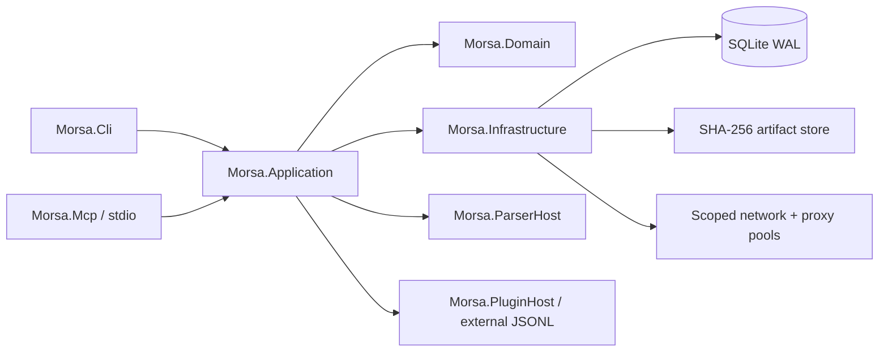

# Architecture

## Direction

Morsa is a modular monolith. Business capabilities share one deployment and one
workspace database, while hostile files and third-party code cross process
boundaries. This avoids sixteen ceremonial projects without turning parsers into
an all-you-can-crash buffet inside the CLI.

## Project responsibilities

| Project | Responsibility | Must not own |
|---|---|---|
| `Morsa.Domain` | entities, status enums, scope rules, evidence rules | EF Core, HTTP, console output |
| `Morsa.Application` | use cases, interfaces, durable task policy | concrete SQLite, proxy socket code |
| `Morsa.Infrastructure` | EF/SQLite, filesystem, HTTP/SOCKS, DNS, tools | CLI rendering |
| `Morsa.Cli` | command validation, human/JSON output, exit codes | domain rules duplicated from application |
| `Morsa.ParserHost` | bounded artifact parsing process | workspace orchestration |
| `Morsa.PluginSdk` | managed contracts | unrestricted service-provider escape hatch |
| `Morsa.PluginHost` | isolated plugin execution | trust in plugin stdout |
| `Morsa.Mcp` | stdio MCP adapter | HTTP listener or workspace escape |

Discovery, Acquisition, Metadata, Correlation, Recon, Web, Malware, and Reporting
are internal modules under those boundaries.

## Durable data flow

1. CLI or MCP resolves a workspace and initializes SQLite migrations.
2. A `Run` records the requested operation and activity mode.
3. Idempotent `Task` rows record pending/running/completed/failed state.
4. Scope and SSRF rules evaluate the destination before network activity.
5. A direct transport or `ProxyLease` executes one bounded attempt.
6. A `NetworkAttempt` records redacted destination, endpoint identity, timing,
   bytes, outcome, and rotation reason.
7. Acquired bytes are hashed before content-addressable storage.
8. The parser process returns observations, evidence locators, and diagnostics.
9. Correlation produces normalized `Entity` and `Relationship` rows linked to
   original `Evidence` and `Artifact` records.
10. Reporters serialize schema-versioned contracts and reproducible bundles.

## Persistence

SQLite is the source of durable state. WAL enables concurrent readers while one
writer journals progress. Core tables represented by `MorsaDbContext` include
projects, scope entries, runs, tasks, artifacts, metadata observations, evidence,
entities, relationships, discovered resources, provider requests, DNS/service/
malware observations, plugin executions, proxy pools/endpoints/health samples/
leases, and network attempts.

Secrets are deliberately absent. `ProxyEndpoint.SecretRef` stores only a locator
such as `env:MORSA_PROXY_A`; the resolved user/password never enters SQLite.

## Trust boundaries

- **CLI/MCP input:** untrusted paths, URLs, JSON, and arguments.
- **Network:** untrusted DNS, redirects, headers, bodies, certificates, proxies.
- **Artifacts:** hostile archives, XML, PDF structures, images, and embedded data.
- **Plugins:** untrusted manifests, ZIP paths, process output, and time behavior.
- **Reports:** sensitive evidence that needs policy-controlled redaction.
- **Release pipeline:** dependencies, compiler, container bases, and artifacts.

The [threat model](threat-model.md) maps each boundary to controls and tests.

## Contracts and compatibility

- Public JSON/NDJSON uses mandatory `schema_version`.
- External plugins use JSONL protocol `morsa-plugin/1` and API version `1`.
- MCP uses the stable `ModelContextProtocol` dependency and stdio transport only.
- Single-file builds are RID-specific, self-contained, and intentionally untrimmed.
- Human output may evolve; machine fields follow documented schema evolution.

## Failure semantics

No partial failure becomes a full success. Diagnostics survive process failure,
pending tasks remain resumable, proxy rotation has finite budgets, provider
failure does not discard other providers' results, and cancellation journals the
last safe state. Strict sandbox mode fails closed when isolation is unavailable.
