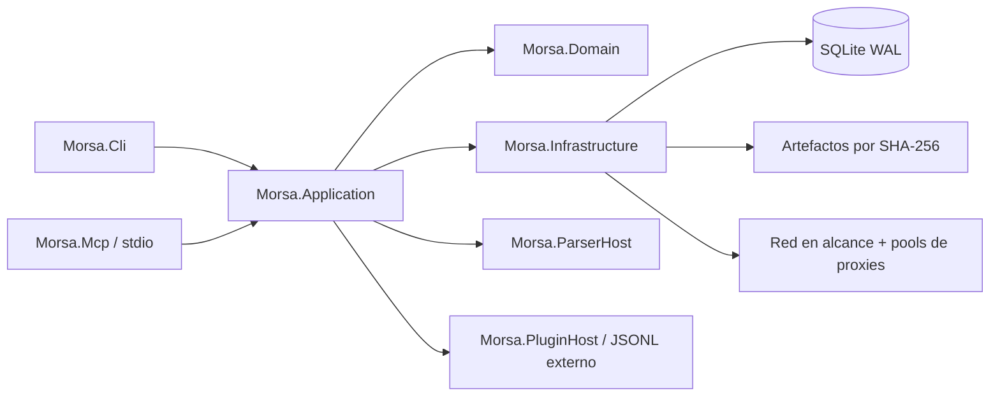

# Arquitectura

## Dirección

Morsa es un monolito modular. Las capacidades comparten un despliegue y una base
SQLite, mientras archivos hostiles y código de terceros cruzan procesos separados.
Así se evitan dieciséis proyectos decorativos sin invitar a cada PDF roto a cenar
dentro del proceso CLI.

## Responsabilidades

| Proyecto | Responsabilidad | No debe poseer |
|---|---|---|
| `Morsa.Domain` | entidades, estados, alcance, evidencia | EF Core, HTTP, consola |
| `Morsa.Application` | casos de uso, interfaces, tareas durables | SQLite o sockets concretos |
| `Morsa.Infrastructure` | EF/SQLite, archivos, HTTP/SOCKS, DNS, tools | presentación CLI |
| `Morsa.Cli` | comandos, salida humana/JSON, exit codes | reglas de dominio duplicadas |
| `Morsa.ParserHost` | parsing acotado en otro proceso | orquestación del workspace |
| `Morsa.PluginSdk` | contratos gestionados | acceso libre al contenedor DI |
| `Morsa.PluginHost` | ejecución aislada | confiar en stdout del plugin |
| `Morsa.Mcp` | adaptador MCP por stdio | servidor HTTP o escape de rutas |

Discovery, Acquisition, Metadata, Correlation, Recon, Web, Malware y Reporting son
módulos internos bajo estos límites.

## Flujo durable

1. CLI/MCP resuelve el workspace e inicializa migraciones.
2. `Run` registra operación y modo de actividad.
3. filas `Task` idempotentes registran pendiente/en ejecución/completada/fallida.
4. Alcance y SSRF validan cada destino antes de usar red.
5. Un transporte directo o `ProxyLease` ejecuta un intento acotado.
6. `NetworkAttempt` conserva destino redactado, endpoint, tiempos, bytes y causa.
7. Los bytes se hashean antes de entrar al almacén content-addressable.
8. ParserHost devuelve observaciones, localizadores y diagnósticos.
9. Correlación crea `Entity` y `Relationship` vinculadas a `Evidence`/`Artifact`.
10. Reporting genera contratos versionados y bundles reproducibles.

## Persistencia

SQLite es el estado durable; WAL permite lectores concurrentes y un escritor. El
`MorsaDbContext` representa proyectos, alcance, runs, tasks, artefactos,
observaciones, evidencias, entidades, relaciones, recursos descubiertos, requests
de providers, DNS/servicios/malware, plugins, pools/endpoints/samples/leases y
attempts de red.

Los secretos no están allí. `ProxyEndpoint.SecretRef` solo guarda un localizador
como `env:MORSA_PROXY_A`; usuario/clave resueltos jamás entran en SQLite.

## Límites de confianza

- CLI/MCP: rutas, URLs, JSON y argumentos no confiables.
- Red: DNS, redirects, headers, cuerpos, certificados y proxies hostiles.
- Artefactos: ZIP/XML/PDF/imágenes y datos embebidos hostiles.
- Plugins: manifest, ZIP, stdout y tiempos no confiables.
- Reportes: evidencia sensible sujeta a redacción.
- Release: dependencias, compilador, imágenes base y binarios.

## Contratos y fallos

JSON/NDJSON exige `schema_version`; plugins externos usan `morsa-plugin/1`; MCP
solo usa stdio; cada single-file es self-contained por RID y no usa trimming.
Un fallo parcial nunca se presenta como éxito total: se conserva diagnóstico,
queda trabajo reanudable, la rotación tiene presupuesto finito y strict sandbox
falla cerrado. Consulta el [modelo de amenazas](modelo-amenazas.md).
